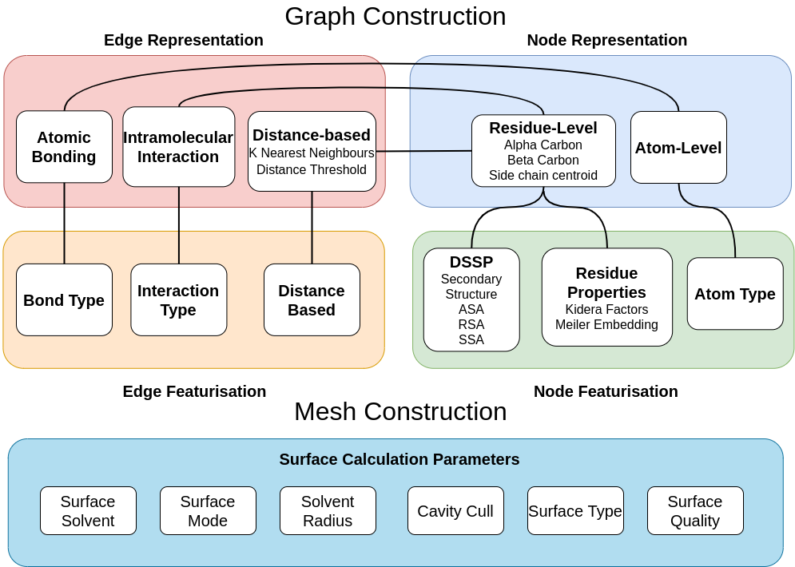

[](https://www.repostatus.org/#active)
[](https://graphein-graphein.readthedocs-hosted.com/en/latest/?badge=latest)
[](https://gitter.im/graphein)
[](https://opensource.org/licenses/MIT)

Protein Graph Library

This package provides functionality for producing a number of types of graph-based representations of proteins. We provide compatibility with standard formats, as well as graph objects designed for ease of use with popular deep learning libraries.

## What's New?
* RNA Graph Construction from Dotbracket notation

## Example usage
```python
from graphein.construct_graphs import  ProteinGraph
from graphein.construct_meshes import  ProteinMesh

# Initialise ProteinGraph class
pg = ProteinGraph(granularity='CA', insertions=False, keep_hets=True,
                  node_featuriser='meiler', get_contacts_path='/Users/arianjamasb/github/getcontacts',
                  pdb_dir='examples/pdbs/',
                  contacts_dir='examples/contacts/',
                  exclude_waters=True, covalent_bonds=False, include_ss=True)

# Create residue-level graphs. Chain selection is either 'all' or a list e.g. ['A', 'B', 'D'] specifying the polypeptide chains to capture

# DGLGraph From PDB Accession Number
graph = pg.dgl_graph_from_pdb_code('3eiy', chain_selection='all')
# DGLGraph From PDB file
graph = pg.dgl_graph_from_pdb_file('examples/pdbs/3eiy.pdb', chain_selection='all')

# Create atom-level graphs
graph = pg.make_atom_graph(pdb_code='3eiy', graph_type='bigraph')

# Initialise ProteinMesh class
pm = ProteinMesh()

# Pytorch3D Mesh Object from PDB Code
verts, faces, aux = pm.create_mesh(pdb_code='3eiy', out_dir='examples/meshes/')
# Pytorch3D Mesh Object from PDB File
verts, faces, aux = pm.create_mesh(pdb_file='examples/pdbs/pdb3eiy.pdb')

# RNA Graph Construction
from graphein.construct_graphs import RNAGraph
rg = RNAGraph()
rna = rg.dgl_graph_from_dotbracket('((((((....))))))', sequence='AUGCAUGCAUGCAUGC')
```

## Parameters
Graphs can be constructed according to walks through the graph in the figure below.

```
granularity: {'CA', 'CB', 'atom'} - specifies node-level granularity of graph
insertions: bool - keep atoms with multiple insertion positions
keep_hets: bool - keep hetatoms
node_featuriser: {'meiler', 'kidera'} low-dimensional embeddings of AA physico-chemical properties
pdb_dir: path to pdb files
contacts_dir: path to contact files generated by get_contacts
get_contacts_path: path to GetContacts installation
exclude_waters: bool - retain structural waters
covalent_bonds: bool - maintain covalent bond edges or just use intramolecular interactions
include_ss: bool - calculate protein SS and surface features using DSSP and assign them as node features
```

## Installation
1. Create env

    ```bash
    conda create --name graphein python=3.7
    conda activate graphein
    ```
  
2. Install Get Contacts
    ```bash
     # Install get_contact_ticc.py dependencies
     $ conda install scipy numpy scikit-learn matplotlib pandas cython seaborn
     $ pip install ticc==0.1.4
      
     # Install vmd-python dependencies
     $ conda install netcdf4 numpy pandas seaborn  expat tk=8.5  # Alternatively use pip
     $ brew install netcdf pyqt # Assumes https://brew.sh/ is installed
    
     # Install vmd-python library
     $ conda install vmd-python
    
     # Set up getcontacts library
     $ git clone https://github.com/getcontacts/getcontacts.git
     $ echo "export PATH=`pwd`/getcontacts:\$PATH" >> ~/.bash_profile
     $ source ~/.bash_profile
    
     # Test installation
     $ cd getcontacts/example/5xnd
     $ get_dynamic_contacts.py --topology 5xnd_topology.pdb \
                               --trajectory 5xnd_trajectory.dcd \
                               --itypes hb \
                               --output 5xnd_hbonds.tsv
    ```

4. Install Biopython
    ```bash
    conda install biopython
    ``` 
   
5. Install RDKit
    ```bash
    conda install -c conda-forge rdkit==2018.09.3
   ```

4. Install [DSSP](https://github.com/cmbi/hssp)

    We use DSSP for computing some protein features
    
    ```bash
    $ conda install -c salilab dssp
    ```

6. Install PyTorch Geometric

    ```bash
    $ pip install torch-scatter
    $ pip install torch-sparse
    $ pip install torch-spline-conv
    $ pip install torch-cluster
    $ pip install torch-geometric
    ```
   
   N.B. Follow the instructions in the Torch-Geometric Docs to install the versions appropriate to your CUDA version.

7. Install [IPyMol](https://github.com/cxhernandez/ipymol)

    ```bash
   $ git clone https://github.com/cxhernandez/ipymol
   $ cd ipymol
   $ pip install . 
   ```
   
   N.B. The PyPi package seems to be behind the github repo. We require functionality that is not present in the PyPi package.
   
8. Install DGL and associated libraries
    ```bash
    $ conda install -c dglteam dgl
    $ conda install -c dglteam dgllife
   ```

8. Install graphein

    ```bash
    $ git clone https://www.github.com/a-r-j/graphein
    $ cd graphein
    $ pip install -e .
    ```